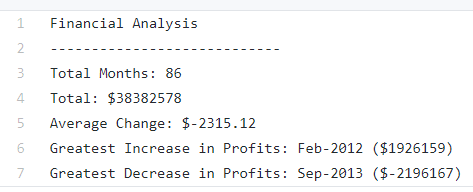

# PyBank Data Analysis
  In this challenge I created a python script (located [here](PyBank/main.py)) to analyze mock bank data [budget_data.csv](PyBank/Resources/budget_data.csv) to find the total revenue accrued, the average change in revenue from month to month, and the months with the greatest increase and greatest loss of revenue over a 7-year period. In addition, I created the text file [PyBankAnalysis.txt](PyBank/Analysis/PyBankAnalysis.txt) that includes the output results, located within the PyBank/Analysis folders.

# PyBank Instructions
 
 Create a python script that analyzes the records to calculate each of the following:

•The total number of months included in the dataset

•The net total amount of "Profit/Losses" over the entire period

•Calculate the changes in "Profit/Losses" over the entire period, then find the average of those changes

•The greatest increase in profits (date and amount) over the entire period

•The greatest decrease in losses (date and amount) over the entire period

  
# PyPoll Data Analysis
  In this challenge I created a python script (located [here](PyPoll/main.py)) to analyze election data [PyPoll_Data.csv](PyPoll/Resources/PyPoll_Data.csv) to calculate the overall total number of votes, the total number of votes and percentage of votes per candidate, and the winner of the election. In addition, I created the text file [PyPollAnalysis.txt](PyPoll/Analysis/PyPollAnalysis.txt) that includes the output results, located within the PyPoll/Analysis folders.
  
# PyPoll Instructions

 Your task is to create a Python script that analyzes the votes and calculates each of the following:

•The total number of votes cast

•A complete list of candidates who received votes

•The percentage of votes each candidate won

•The total number of votes each candidate won

•The winner of the election based on popular vote

